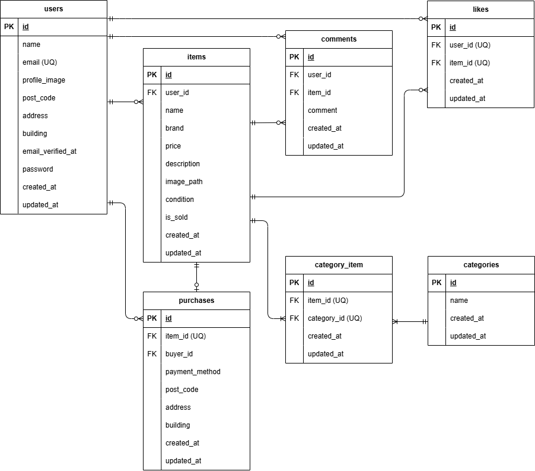

# coachtech フリマアプリ

## アプリ概要

本アプリはフリーマーケット機能を備えたWebアプリです。
商品を直感的に出品・購入できるシンプルな操作性を重視して開発しました。
ユーザー認証にはメール認証機能を導入し、安全にサービスを利用できる設計としています。

従来のフリマアプリにおける「機能や画面の複雑さ」を課題とし、
ユーザーが迷わず利用できるUI/UXを意識して設計しています。

設計から実装、テストまで一貫して開発しています。

## 機能一覧

### 商品閲覧機能

- 商品一覧表示
- 商品詳細表示

### 出品・購入機能

- 商品出品機能
- 商品購入機能（Stripe決済）
- 送付先住所の登録・変更

### ユーザー機能

- 会員登録・ログイン機能
- メール認証機能
- マイリスト機能（いいね登録）
- プロフィール表示機能（出品・購入商品の確認）
- プロフィール編集機能

## 環境構築

### バックエンド（Laravel）

#### Dockerビルド

```
git clone git@github.com:misone-ne/test-flea-market.git
cd test-flea-market
docker compose up -d --build
```

#### Laravel環境構築

```
docker compose exec php composer install
cp src/.env.example src/.env
```

※DB接続のため、.envを以下に修正してください

```
DB_CONNECTION=mysql
DB_HOST=mysql
DB_PORT=3306
DB_DATABASE=laravel_db
DB_USERNAME=laravel_user
DB_PASSWORD=laravel_pass
```

※メール認証機能利用のため、.envに以下を追加してください

```
MAIL_MAILER=smtp
MAIL_HOST=mailhog
MAIL_PORT=1025
MAIL_USERNAME=null
MAIL_PASSWORD=null
MAIL_ENCRYPTION=null
MAIL_FROM_ADDRESS=test@example.com
MAIL_FROM_NAME="Flea Market"
```

```
docker compose exec php php artisan key:generate
docker compose exec php php artisan migrate:fresh --seed
docker compose exec php php artisan storage:link
```

### フロントエンド（Vite）

#### フロント環境構築

※本アプリではSCSSコンパイルにViteを使用しています

Nodeモジュールをインストール

`docker compose exec node npm install`

開発環境起動

`docker compose exec node npm run dev`

本番環境ビルド

`docker compose exec node npm run build`

## トラブルシューティング

### storage / bootstrap/cache の権限エラーが発生する場合

以下を実行してください。

```
docker compose exec php chmod -R 775 /var/www/storage
docker compose exec php chmod -R 775 /var/www/bootstrap/cache
docker compose exec php chown -R www-data:www-data /var/www/storage
docker compose exec php chown -R www-data:www-data /var/www/bootstrap/cache
docker compose exec php php artisan optimize:clear
docker compose restart
docker compose exec node npm run dev
```

## 外部サービス

### Stripe決済（テスト環境）

本アプリではStripe Checkoutを使用しています。

#### 設定手順

Stripeアカウントを作成し、テストモードで以下を取得してください：

- Stripe管理画面にログイン
- 「開発者 → APIキー」から公開キー、シークレットキーを取得
- 取得したキーを .env に設定

```
STRIPE_KEY=pk_test_xxxxxxxxxxxxxxxxx
STRIPE_SECRET=sk_test_xxxxxxxxxxxxxxxx
```

#### 使用している支払い方法

- カード決済（card）
- コンビニ決済（konbini）
  ※コンビニ決済は日本のStripeアカウントでのみ使用可能です

#### テスト決済

以下のテストカードが使用できます：

- 4242 4242 4242 4242
  ※有効期限は任意の未来日付・CVCは任意の3桁の値を使用できます

#### 注意事項

- 本プロジェクトはテスト環境（Stripe Sandbox）で動作しています
- 実際の決済は発生しません
- 決済完了後はStripeからアプリにリダイレクトされます
- 支払いの確定処理はWebhook未実装のため、決済完了画面への遷移時点で購入完了として扱っています

## 使用技術（実行環境）

### バックエンド

- PHP
- Laravel

### フロントエンド

- Vite
- SCSS
- Blade（Laravelテンプレート）

### データベース

- MySQL

### インフラ・開発環境

- Docker / Docker Compose
- Nginx
- phpMyAdmin

### 外部サービス

- Stripe（決済機能 / テストモード）

### その他

- Node.js（Viteビルド用）
- Composer
- Git / GitHub（バージョン管理）

## バージョン

- PHP: 8.3
- Laravel: 13.5
- MySQL: 8.0
- Node.js: 20.20
- npm: 10.8

## ER図



## URL

- 商品一覧画面：http://localhost/
- 商品詳細画面：http://localhost/item/{item_id}
- 会員登録画面：http://localhost/register
- ログイン画面：http://localhost/login
- メール認証誘導画面：http://localhost/email/verify/notice （要ログイン）
- 商品購入画面：http://localhost/purchase/{item_id} （要ログイン）
- 送付先住所変更画面：http://localhost/purchase/address/{item_id} （要ログイン）
- 商品出品画面：http://localhost/sell （要ログイン）
- プロフィール画面：http://localhost/mypage （要ログイン）
- プロフィール編集画面：http://localhost/mypage/profile （要ログイン）
- MailHog：http://localhost:8025
- phpMyAdmin：http://localhost:8080

## テスト

PHPUnitを使用して機能テストを実施

### 実行コマンド

- `docker compose exec php php artisan test`

### 実行結果

全41件の機能テスト成功

### テスト内容

- 会員登録機能
- ログイン機能
- ログアウト機能
- 商品一覧取得
- マイリスト一覧取得
- 商品検索機能
- 商品詳細情報取得
- いいね機能
- コメント送信機能
- 商品購入機能
- 支払い方法選択機能
- 配送先変更機能
- ユーザー情報取得
- ユーザー情報変更
- 出品商品情報登録
- メール認証機能

---

※本プロジェクトは学習目的で作成したフリマアプリです。
